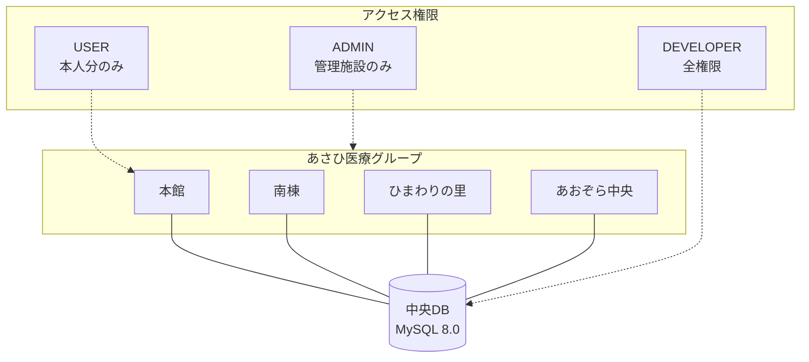
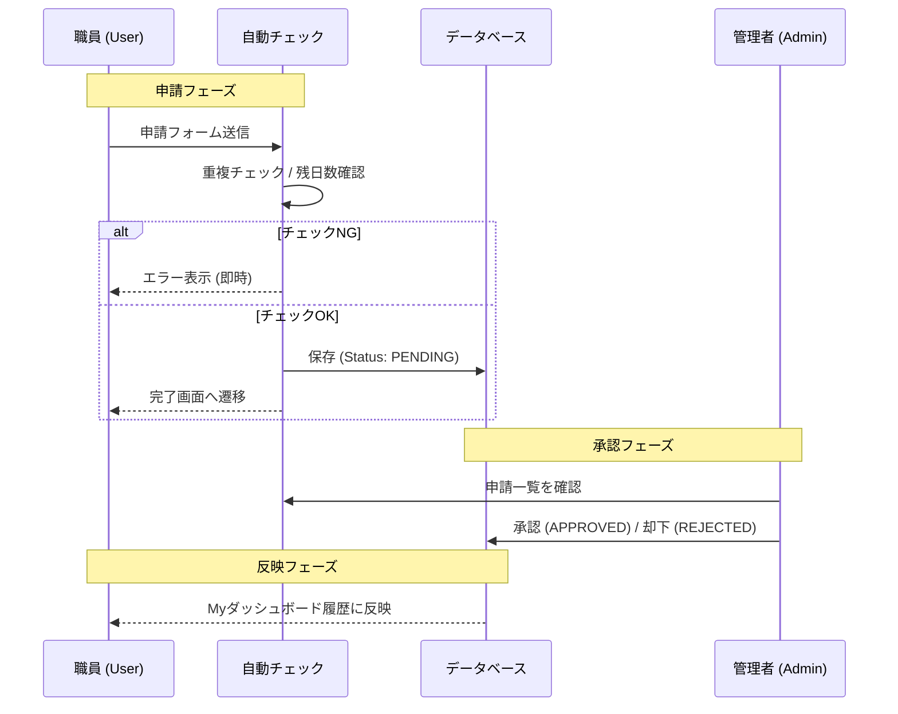

# 医療・介護施設向け 感染対策マニュアルLMS 🏥

あさひ医療グループ内の複数施設（本館、南棟、ひまわりの里病院、あおぞら中央クリニック）を横断して、職員の学習状況と権限を管理するための学習管理システム（LMS）です。医療現場での感染対策知識の平準化と、管理業務の自動化を目的としています。

---


## 📖 目次 (Table of Contents)

- [🚀 プロジェクト概要](#-プロジェクト概要)
- [✨ 実装済みの主要機能](#-実装済みの主要機能)
- [🗓️ 有給休暇・勤怠管理システム](#-有給休暇勤怠管理システム-phase-1)
- [📖 ユーザー向け操作マニュアル](#-ユーザー向け操作マニュアル-user-manual)
- [📦 開発者への約束事](#-開発者への約束事)
- [🔧 開発者向けセットアップ](#-開発者向けセットアップ)
- [🗺️ 今後のロードマップ](#-今後のロードマップ-roadmap)

---

## 🚀 プロジェクト概要

- **目的**: 施設横断的な感染対策マニュアルの共有と学習進捗の可視化。
- **ターゲット**: 看護師、介護士、事務職など、施設に所属する全職員。
- **特徴**: 厳格な監査ログと、職種・拠点に応じた権限管理。

### 🏗️ システム全体像 (Architecture)



---

## 🛠 技術スタック (Tech Stack)

| カテゴリ | 技術 |
| :--- | :--- |
| **Frontend** | React, Vite, Tailwind CSS, Lucide React (Icons) |
| **Backend** | Java (Spring Boot 3), Spring Security, Hibernate (JPA) |
| **Database** | MySQL 8.0 |
| **Testing** | Vitest (Frontend & API Security Integration) |
| **Infrastructure** | Docker, Docker Compose |
| **DevOps** | Spring Boot DevTools, backend-watcher (inotify), Vite HMR, Vitest Watch |

---

## 📋 開発運用ルール (Development Rules)

スムーズかつ安全な開発を継続するため、以下のルールを定義します。

### 1. 開発の完全自動化
本プロジェクトでは、Docker Compose を活用した「保存即反映」の環境を構築しています。
- **Backend (Hot Reload)**: `backend-watcher` がソースコードの変更を検知し、自動で再コンパイルを実行、DevTools がアプリを再起動します。
- **Frontend (HMR)**: Vite のポーリングモードが有効になっており、Docker上でも確実に画面が更新されます。
- **Testing (Auto Test)**: `vitest-watch` サービスにより、テストがバックグラウンドで常時実行されます。

### 2. Git ブランチ運用ポリシー
機能追加や修正を行う際は、以下の命名規則に従ってブランチを新設します。
- **機能追加**: `feature/機能名`
- **バグ修正**: `fix/課題名`
- **ドキュメント**: `docs/項目名`

> [!NOTE]
> AIエージェントは、新しいタスクを開始する際に自動的にブランチを作成し、その上で作業を行います。

### 3. コマンド自動化とコミット規則
作業完了時、AIエージェントは以下の形式で自動コミットを実行します。
- **形式**: `prefix: 変更内容の要約`
- **プレフィックス例**: `feat`, `fix`, `docs`, `refactor`, `test`, `chore`
- **例**: `feat: ユーザーCSV一括登録機能の実装`

---

## 最近の変更
### [ヒーローヘッダー (Warm Orange UI) の導入]
- **feat**: UIの「無機質さ」を解消するため、オレンジ系の帯（Hero Header）を導入。
  - Material Design 3の `Secondary Container` トーンをベースにした親しみやすい配色への変更。
  - 各ページ上部に `PageHeader` コンポーネントを配置し、視認性と温かみを向上。
  - `rounded-[28px]` を徹底し、医療現場での安心感を演出。
  - **適用範囲拡大**: ユーザー管理、組織管理、開発者ダッシュボードにも同様のデザインを適用し、システム全体の一貫性を確保。


### [Header Visibility Fix] (Fix: Header Visibility)
- **fix**: ヘッダー背景を明示的に指定し、視認性を抜本的に改善。
  - 背景色を `#2D1600` (ダークオレンジブラウン) に固定。
  - 特徴的なキャッチコピー「想像力で、現場をアップデートする。」を追加。
  - `src/theme/colors.js` を新設し、テーマカラーの管理を強化。

### [Console & Logout Position Refactor] (Fix: Console & Logout)
- **fix**: システムログコンソールの視認性改善とログアウトボタンの移設。
  - 開発者画面のログコンソール背景を完全に不透明 (`bg-slate-900`) にし、`z-index` を調整して最前面に表示。
  - ログアウトボタンをサイドバーからヘッダー（ユーザーアイコン横）に移設し、利便性を向上。

### [Material Design 3 UIアップデート] (feature/ui-m3-update)
- **feat**: UIコンポーネントをMaterial Design 3 (M3) の形状ガイドラインに準拠させるデザインリフレッシュ。
  - **Shape Scale**: `tailwind.config.js` に M3 Shape トークン (`m3-xs` ～ `m3-xl`) を導入。
  - **Button**: M3 elevation shadow、state layer（brightness変更によるホバー）、loading spinner 内蔵。
  - **Card**: 角丸を `rounded-m3-xl` (28px) に拡大、影を抑え Surface 階層で深度を表現。
  - **Input**: M3 Outlined（角丸ボーダー）と Filled（上角丸＋下線）スタイルを明確化。
  - **Badge**: `rounded-md` → `rounded-full`（ピル形状）に変更。
  - **ConfirmModal**: M3 Dialog 仕様（`rounded-m3-xl`, scrim color, ピル形状ボタン）に刷新。
  - **PageHeader**: アイコンコンテナ角丸拡大、M3 カラートークン統一。
  - **Login**: 全入力・ボタン・カードを M3 トークンで統一。

### [管理者ダッシュボード表示バグ修正] (fix/dashboard-duplicate-view)
- **fix**: 有給取得モニタリングコンポーネントの重複呼び出しを解消。
- **feat**: モニタリングリストに `max-height` と内部スクロールを設定し、大量データ表示時のレイアウト崩れを防止。
- **feat**: テーブルヘッダーを `sticky` に変更し、視認性を向上。

### [有給取得義務カードのM3最適化と期限表示追加] (feature/paid-leave-m3-card)
- **feat**: 有給取得義務カードを M3 (Material Design 3) の "Elevated Card" スタイルに刷新。
- **feat**: プログレスバーのデザイン（太さ・配色）を M3 仕様に最適化。
- **feat**: 年度ごとの有給取得期限（基準日の1年後）の表示を追加。
- **fix**: 期限切迫時（残り3ヶ月未満）の警告表示をより強調されたデザインに改善。

### [有給休暇の期間指定・一括申請機能] (feature/extend-paid-leave-request)
- **feat**: 有給休暇申請フォームを一括申請対応型 (`PaidLeaveRequestForm`) に刷新。
- **feat**: 「期間を追加」ボタンにより、飛び石連休や複数の期間を一度に申請可能に。
- **feat**: 申請期間の合計日数をリアルタイムで自動計算・表示。
- **feat**: バックエンドに一括申請用エンドポイント (`/leaves/apply-bulk`) を追加し、トランザクション内での重複チェックと残日数管理を強化。

### [お知らせ機能 (Announcement)] (feature/announcement-management)
- **feat**: 管理者によるお知らせ作成・編集・削除機能（優先度、掲載期限、対象施設の設定）。
- **feat**: ダッシュボード上部への「お知らせ」セクション追加（未読、重要度に応じたアイコン表示）。
- **feat**: 全施設共通または特定施設向けのお知らせ配信制御。
- **fix**: サイドメニューのアクティブ状態ハイライトを修正（完全一致・サブパス判定で正確に動作）。
- **feat**: サイドメニューのADMINセクションに「お知らせ管理」メニューを追加。
- **feat**: お知らせ投稿フォームの実装（M3スタイル、開発者向け配信対象選択機能）。

## ✨ 実装済みの主要機能

<details>
<summary><strong>🆕 最近のアップデート / 更新履歴 (2026-02-08)</strong></summary>

#### 【セキュリティ】管理者パスワードの強制リセットおよびパスワード変更強制機能の実装
- **課題**: 管理者アカウントのパスワード紛失によるログイン不能問題の解消。および、セキュリティ向上のための初回ログインパスワード変更の強制。
- **修正内容**:
  - `users` テーブルへの `must_change_password` カラム追加（デフォルト1：要変更）。
  - `admin` ユーザーのパスワードを `admin123` にリセット。
  - 変更が完了するまで全機能へのアクセスを遮断するルーティングガードの実装。

#### 【UX改善・バリデーション】申請完了専用ページの実装と重複申請防止ロジックの導入
- **課題**: 申請後の通知が `alert()` のみで分かりにくかった点、および誤操作による重複申請の防止。
- **修正内容**:
  - 有給休暇の期間重複、および勤怠変更の同一日・同一種別の重複をブロックするバリデーション。
  - 申請完了専用画面（`SubmissionSuccessPage.tsx`）への自動遷移。
  - バリデーションエラーをフォーム上に日本語で具体的に表示。
  - バリデーションエラーをフォーム上に日本語で具体的に表示。

#### 【Myダッシュボード】申請履歴のフィルタリングと過去データのページネーション
- **課題**: 申請履歴が増加した際の一覧性低下、および過去の履歴（1年以上前）へのアクセス手段の欠如。
- **修正内容**:
  - **フィルタリング**: 「有給休暇」「欠勤」「遅刻」「早退」の種別ごとに履歴を絞り込み表示。
  - **視認性向上**: 有給休暇の「全日」「半日(午前)」「半日(午後)」を専用アイコン（太陽・朝日・夕日）とラベルで明確に区別。
  - **ページネーション**: デフォルトで直近1年の履歴を表示し、「過去の履歴を読み込む」ボタンで更に過去のデータをシームレスに取得可能に。
  - **再計算エンジン**: 過去の全履歴をトレースし、現在の有給残日数を厳密に再計算するバッチ処理を実装。

#### 【有給休暇】自動付与・残日数計算ロジックの実装
- **課題**: 入社日に基づく法定通りの有給自動付与と、有効期限（2年）を考慮した厳密な残日数管理。
- **修正内容**:
  - **自動付与**: 入社半年後（10日）から勤務期間に応じて法定日数を自動付与（最大20日）。
  - **残日数計算**: 「有効期限内の付与日数」から「消化済み日数」を差し引くシミュレーション方式を採用。
  - **期限管理**: 付与から2年経過した有給を自動的に失効扱いとするロジックを適用。
  - **次回付与予測**: Myダッシュボードに次回の付与予定日と日数を表示し、計画的な取得を促進。
  - **次回付与予測**: Myダッシュボードに次回の付与予定日と日数を表示し、計画的な取得を促進。

#### 【有給休暇】年5日の取得義務アラート機能
- **課題**: 労働基準法に基づく「年5日の有給休暇取得義務」の遵守状況を可視化し、未達成リスクを低減する。
- **修正内容**:
  - **義務判定ロジック**: 基準日（付与日）からの1年間を計算期間とし、その期間内に承認された有給休暇日数を自動集計。
  - **進捗可視化**: Myダッシュボードに「年5日の取得義務状況」カードを追加。達成率をプログレスバーで表示。
  - **警告アラート**: 義務達成の期限が近づくと（期間の3/4経過後かつ未達成時）、警告アイコンとメッセージで注意喚起。
  - **達成ステータス**: 義務（5日）を達成すると、緑色のチェックマークで「達成済み」を明確に表示。

#### 【労務管理】全職員の有給取得状況モニタリング画面
- **課題**: 管理者が全職員の有給取得義務（年5日）の進捗状況を把握し、未達リスクのある職員を早期に発見・指導するための仕組みが不足していた。
- **修正内容**:
  - **モニタリング画面**: 管理者ダッシュボードに「有給モニタリング」タブを新設。全職員の取得数、残日数、義務達成状況を一覧表示。
  - **基準日判定ロジック**:
    - 入社日の6ヶ月後を「初回基準日」とし、以降1年ごとに基準日を更新します。
    - **現在適用期間**: 直近の基準日から1年間を「現在の義務期間」として判定します。
    - **チェック機能**: 「現在期間の進捗」に加え、「直前の期間」における義務違反も検知し、赤色アラートで警告します。
    - **判定優先順位**: 過去に義務違反があった場合でも、**現在の取得義務（5日）を達成している場合は「達成」ステータスを優先**し、違反バッジは非表示となります。
  - **アラート機能**: 取得義務未達（5日未満）の職員をハイライト表示。さらに、期限まで3ヶ月を切った未達者を「要注意（Critical）」として赤色で警告。
  - **クイックフィルタ**: 「未達・要注意のみ」をワンクリックで抽出できるフィルタ機能を実装し、フォロー業務を効率化。

#### 【UX改善】エラーメッセージの完全日本語化
- **課題**: システムのエラーメッセージ（入力必須、日付前後関係など）が英語のままであり、ユーザーにとって不親切だった。
- **修正内容**:
  - **バリデーション**: `ValidationMessages.properties` を導入し、Spring Bootの標準バリデーションメッセージを日本語化。
  - **APIエラー**: `GlobalExceptionHandler` を実装し、全てのAPIエラーレスポンスを日本語の統一フォーマットで返却。
  - **フロントエンド**: 画面上のバリデーション警告やトースト通知を全て日本語に翻訳。
</details>

## 運用・メンテナンス履歴
- **2026-02-08**: クリティカルパス上の重複申請データ (`honkan001`) をSQLマイグレーション (`V2026_02_08_4__cleanup_honkan001_paid_leaves.sql`) により論理削除しました。
- **2026-02-08**: テストデータ完全リセットのため、`honkan001` の有給・勤怠申請データをSQLマイグレーション (`V2026_02_08_5__force_cleanup_honkan001.sql`) により物理削除しました。

### 🛡️ 権限管理・組織管理
- **4拠点対応**: 本館、南棟、ひまわりの里病院、あおぞら中央クリニックの組織構造を管理。
- **RBAC**: DEVELOPER, ADMIN, USER の3段階ロールによる厳格なアクセス制御。

### 🚨 セキュリティ異常検知 (Security Anomaly Detection)
- **異常アクセス検知**: 以下のパターンを自動検知し、開発者ダッシュボードでアラート表示。
  - **深夜アクセス**: 00:00 - 05:00 (JST) のシステム利用。
  - **短時間大量アクセス**: 1分間に規定回数以上のAPIリクエスト。
  - **大量ダウンロード**: 短時間でのマニュアル大量取得。
  - **ログイン試行エラー**: 連続したログイン失敗の記録。
- **アラート管理**: 重要度（Critical, High, Medium, Low）に応じた色分け表示と、ステータス管理（未確認・確認済み・解決済み）。
- **即時通知**: 開発者ダッシュボードのトップにセキュリティアラートセクションを配置し、システム異常を即座に把握可能。

### 📋 監査ログ & ユーザー管理
- **監査ログ**: 「誰が・いつ・何をしたか」を **JST（日本時間）** で記録。改ざん不可能な証跡保管。
- **ユーザー管理**: 個別追加フォーム ＋ CSV一括登録（ID重複、施設名バリデーション付き）。
- **退職者管理ポリシー**: 
  - **データの永続性**: 退職者は物理削除されず、アーカイブ（論理削除）として保持され、学習履歴や監査ログは失われません。
  - **再就職（復元）対応**: 復職時はCSV一括登録機能がアーカイブ済みIDを検知し、学習履歴を引き継いだ状態で復元・上書き更新を行います。
- **有給休暇・入社日管理**: 
  - **入社日設定**: ユーザーごとに「入社日」を設定可能。新規登録時および既存ユーザーの編集画面から設定できます。
  - **有給付与・残管理**: 管理者がユーザーの「有給残日数」を直接更新でき、Myダッシュボードでの有給申請時に正しく反映されます。
  - **整合性維持**: 既存ユーザーに対しても、編集画面から入社日や有給残日数を一括で更新可能です（単一のAPIリクエストで完結）。
  - **ログ記録**: 有給残日数や入社日の変更は、通常のユーザー更新（USER_UPDATE）または専用更新（USER_LEAVE_UPDATE）として監査ログに詳細が記録されます。

### 🔑 ハイブリッド・ユーザーオンボーディング
- **柔軟な導入フロー**:
  - **招待リンク方式**: メールやチャットで「招待リンク」を共有し、ユーザー自身がパスワードを設定して利用開始。
  - **仮パスワード発行**: 管理者が「仮パスワード」を発行し、代理で初期設定やサポートを行うことが可能。
- **初回ログイン時のパスワード変更強制**: どちらの方式でも、セキュリティのため初回ログイン時（または仮パスワード使用時）にパスワード変更を強制。

### 🔧 管理者・開発者機能
- **統合開発者ダッシュボード (Integrated Developer Dashboard)**: 
  - システム統計、稼働状況、レポート出力、操作履歴をタブ形式で一元管理。
  - DEVELOPERロールによる厳格なアクセス制御。
- **ロールベース・サイドバー (Role-based Sidebar)**:
  - 権限に応じてメニュー項目を動的にフィルタリングし、セクション（メイン/管理/開発）ごとに視覚的に分離。
  - **一般ユーザー (Staff)**: マニュアル、Myダッシュボードのみ表示。
  - **管理者 (Admin)**: 管理者ダッシュボード、ユーザー管理、組織管理（自施設のみ）を追加表示。
  - **開発者 (Developer)**: 開発者メニューを含む全項目を表示。
- **サイドメニュー構成 (2026-02-10)**:
  - `Sidebar.tsx` を独立コンポーネント化し、高密度かつモダンなデザインに刷新。
  - **アクティブ表示**: 選択中の項目は `bg-orange-500`（オレンジ背景）に白抜き文字で強調。
  - **視覚的セグメンテーション**: 管理設定セクションには薄い背景色（Slate/Amber）を適用し、誤操作防止と視認性向上を実現。

### 🎨 デザインシステム（Design System） - M3 Overhaul

アプリケーション全体の一貫性を保つために、**Material Design 3 (M3)** に完全準拠したデザインシステムを導入しました。

#### コンセプト
- **Medical Trust**: 信頼感のある `Teal (#006A6A)` をプライマリカラーに採用。
- **Human Centered**: 丸みを帯びた `rounded-xl` や `pill-shape` を多用し、親しみやすさを強調。
- **Clean Structure**: 影（Shadow）に頼らず、**Surface Colors（表面色）の濃淡** で情報の階層を表現。

#### 主要コンポーネント
- **Navigation Drawer**: 項目選択時に角丸の「カプセル形状」インジケーターが表示され、直感的な操作が可能。
- **Card**: 背景色 `m3-surface-container-low` とボーダーレスなデザインで、コンテンツをスッキリと整理。
- **Typography**: `Noto Sans JP` を採用し、`leading-relaxed` で行間を広げ、長時間の学習でも疲れにくい可読性を実現。

#### カラートークン（`tailwind.config.js`）

| トークン | 色コード | 用途 |
|---------|---------|------|
| `m3-primary` | `#006A6A` | **メインアクション**、アクティブ状態 |
| `m3-surface` | `#F0F4F4` | ベースとなる背景色 |
| `m3-background` | `#FBFCFD` | アプリケーション全体の背景 |
| `m3-error` | `#BA1A1A` | エラー表示、削除アクション |

#### 共通ユーティリティクラス（`index.css`）

| クラス名 | 説明 |
|---------|------|
| `body` | アプリ全体の背景・文字色・フォント設定を `@layer base` で適用 |
| `.card` | 今後廃止予定（M3コンポーネントへ移行中） |

#### 統一状況 (2026-02-11)
- **全画面適用**: ログイン、ダッシュボード、管理画面すべてにおいてM3デザインが適用されました。
- **ビルド安定化**: Tailwind CSSのビルドプロセスを見直し、カスタムカラー定義が確実に反映されるよう修正済みです。

### 🏢 組織管理（施設・部署マスタ）
- **施設マスタ**: 病院・クリニック等の施設を登録・編集・削除（論理削除）。
- **部署マスタ**: 各施設に紐づく部署を登録・編集・削除。
- **データ整合性**: 施設削除時は関連する部署も同時に論理削除。
- **動的連動**: ユーザー登録・編集画面の施設/部署プルダウンは、組織管理マスタと自動連動。
- **アクセス制御**: ロールに応じてサイドバーの表示項目が自動的に切り替わります（RBAC対応）。

#### 組織の追加手順
1. サイドメニューの「**組織管理**」をクリックします。
2. 「**施設を追加**」ボタンをクリックし、施設名を入力して保存します。
3. 追加した施設の行をクリックして展開し、「**部署を追加**」から部署を登録します。
4. ユーザー登録画面に戻ると、追加した施設・部署がプルダウンに反映されます。

#### UI/UX Design Philosophy (High Density)
- **High Density Layout**: 垂直方向のマージンやパディングをさらに詰め（space-y-4/mb-2等）、プロフェッショナルな情報密度を実現しました。
- **全ユーザー管理**: バックエンド連携による施設フィルタリングに対応し、大量のデータでも高速に検索・復元が可能です。
- **Error Handling**: 通信エラー発生時にアラートではなく、インラインで再試行可能なメッセージを表示するよう改善しました。
- **Null-safety**: 施設や部署が未設定の古いデータが存在しても、安全にリスト表示されるよう堅牢性を高めています。
- **Professional Aesthetics**: アイコンサイズの微調整と適切な余白設定により、情報の視認性を維持しつつコンパクトなUIに仕上げました。
- **Mobile & Small Screen Optimizations**: 13インチ以下の端末でもスクロールなしで重要情報へアクセスできるよう、入力フォームと一覧リストを高密度 (High Density) レイアウトに刷新しました。
- **Clear Date Visualization**: 申請履歴の日付表示を「取得予定日（大きく表示）」と「申請日（小さく表示）」に分離し、いつ休むのかが直感的に分かるように改善しました。また、申請タイプを日本語化（例：PAID_LEAVE → 有給休暇）し、視認性を向上させました。
- **Card-Based Navigation**: Myダッシュボード上部のサマリーカード（学習完了・有給残日数・お知らせ）をナビゲーションスイッチとして機能させ、直感的な画面切り替えを実現しました。現在の選択状態が視覚的（Ring/Border）に強調されます。
- **Smart Paid Leave Tracking**: 有給休暇の承認時に自動的に残日数を減算（全日-1.0/半日-0.5）するロジックを実装。さらにMyダッシュボードでは「申請中を含む実質残日数」を併記し、計画的な取得をサポートします。
- **Recalculation Engine**: 過去のデータ不整合を解消し、常に正しい有給残日数を算出する「再計算エンジン」を導入。アプリケーション起動時に自動的に整合性チェックと修正が実行されます。
- **Localization**: 管理画面の勤怠種別を「遅刻/早退/欠勤」と日本語化し、直感的な管理を可能にしました。

> [!TIP]
> 施設を選択すると、その施設に紐付く部署のみがプルダウンに表示されます（連動機能）。

#### 初期データ自動投入とマイグレーション仕様
アプリケーション起動時に `DataSeeder` コンポーネントが以下の処理を実行します：

1. **初期マスタデータの自動投入**:
   - 新規インストール時、以下の施設・部署が自動生成されます：
     - 本館（3階病棟、4階病棟、リハビリテーション、事務部、栄養課）
     - 南棟（2階病棟、3階病棟、透析室）
     - ひまわりの里病院（外来、薬局、検査室）
     - あおぞら中央クリニック（診療外来、訪問看護）

2. **既存データとの互換性**:
   - User テーブルの `facility` / `department` は引き続き文字列として保存
   - 組織マスタと文字列名で紐付けるため、既存ユーザーデータへの影響なし
   - マスタ登録後、ユーザー登録画面のプルダウンに自動反映

> [!IMPORTANT]
> 組織マスタと既存データの整合性を保つため、施設・部署名の表記は統一してください。

#### 重複データの発生防止策
以下の多層防御により、施設・部署データの重複を防止しています：

1. **DB制約**: `departments` テーブルに `(facility_id, name, deleted_at)` のユニーク制約を設定
2. **起動時クリーンアップ**: `DataCleaner` が既存の重複データを自動削除（最小IDを保持）
3. **Seeder のチェック**: `DataSeeder` が `existsBy...` で既存チェック後に投入
4. **フロントエンド重複排除**: ドロップダウン表示時に `Set` で重複を除去

### 📊 レポート出力
- **CSV/PDFエクスポート**: 学習進捗データを施設・期間でフィルタリングし、CSV/PDF形式でダウンロード可能。
- **施設別フィルタリング**: 組織管理（施設マスタ）から取得した最新の全施設から選択してエクスポート可能。
- **期間指定**: 開始日・終了日を指定した期間内の進捗データを抽出。
- **Excelと互換性**: CSV出力はUTF-8 BOM付きでExcelでの文字化け対応。
- **高品質デザイン**: 高密度レイアウトにより、狭い画面でもフィルター操作とエクスポートがスムーズ。
- **ファイル名**: CSVは `compliance_report_YYYYMMDD.csv`、PDFは `compliance_report_YYYYMMDD.pdf` 形式で保存。

### 📢 督促通知 & 進捗管理 (Dashboard v2.0)
- **進捗遅延マニュアル TOP3**: 全社的に進捗が遅れているマニュアルをダッシュボードトップに表示し、重点的に指導すべきポイントを可視化。
- **ワンクリック督促**: 未完了ユーザーのリストから直接「督促 (Remind)」ボタンをクリックすることで、通知（メール等）を送信可能。
- **施設別CSVエクスポート**: 管理者ダッシュボード上で、表示中のフィルタ条件（施設・部署）を維持したまま即座にCSVを出力可能。

### 🏠 Myダッシュボード (My Dashboard)
- **URL**: `/my-dashboard`
- **学習進捗**: 完了したマニュアル数や今月の読了数をカード形式で表示。
- **お知らせ**: 通知エリア（未読件数表示）。
- **労務管理 (Attendance Request)**:
  - **UI設計**: 「新規申請」と「申請履歴」を 5:7 の比率で配置し、申請フォームの視認性を向上。
  - **申請種別**: 有給休暇、欠勤、遅刻、早退に対応。
  - **時間指定**: 遅刻・早退申請時は、専用のドロップダウンUIにより15分単位（00, 15, 30, 45分）での精密な申請が可能。バックエンドでもバリデーションを強制。
  - **有給休暇オプション**: 全日、半日 (午前)、半日 (午後) を選択可能。
  - **履歴**: 申請ごとのステータスと却下理由の詳細表示。
  - **残日数**: 有給休暇の残日数を表示（半日取得時は0.5日消化）。

### 🗓️ 有給休暇・勤怠管理システム (Phase 1)
- **多施設管理者対応**: `user_facility_mapping` テーブルにより、管理者が複数施設を跨いで申請を管理可能。
- **有給付与履歴**: `paid_leave_accruals` テーブルで手動付与の履歴を記録。管理者・開発者が任意のユーザーに有給を付与可能。
- **取得種別**: 全日 (FULL)、半日午前 (HALF_AM)、半日午後 (HALF_PM) を選択可能。半日申請時は0.5日消化。
- **権限別フィルタリング (RBAC)**:
  - `ROLE_USER`: 自分の申請のみ閲覧。
  - `ROLE_ADMIN`: 自身が管理する施設（`user_facility_mapping`で紐付け）内のユーザーの申請を閲覧・承認。
  - `ROLE_DEVELOPER`: 全施設の全申請を閲覧・承認。
- **論理削除**: 全テーブルに `deleted_at` カラムを実装し、データの完全性を維持。

#### 🔄 申請・承認フロー (Application Flow)



### 📊 現状の実装ステータス (2026-02-08 時点)

#### 1. ロール別権限と操作範囲

| ロール | できること | できないこと |
|--------|-----------|-------------|
| **ROLE_USER** | 自分の有給/勤怠申請の作成・閲覧、残日数確認 | 他人の申請閲覧、承認/却下、有給付与 |
| **ROLE_ADMIN** | 有給申請: 管理施設内の閲覧・承認・却下、手動有給付与 | ⚠️ 勤怠申請: 現状は全件見える（RBACなし） |
| **ROLE_DEVELOPER** | 全施設の全申請を閲覧・承認・却下、全ユーザーへの有給付与 | 特になし（最大権限） |

#### 2. 機能別実装状況

| 機能 | DB | API | UI | 備考 |
|------|:--:|:---:|:--:|------|
| 有給申請（全日/半日） | ✅ `paid_leaves.leave_type` | ✅ RBAC適用済 | ✅ | `PaidLeaveService.getAllRequests()` で施設フィルタ実装 |
| 勤怠申請（遅刻/早退/欠勤） | ✅ `attendance_requests` | ✅ RBAC適用済 | ✅ | `AttendanceRequestService.getAllRequests()` で施設フィルタ実装 |
| 15分単位の時間入力 | ✅ `start_time`, `end_time` | ✅ バリデーション済 | ✅ | 00/15/30/45分のみ許可 |
| 複数施設管理 | ✅ `user_facility_mapping` | ✅ | ⚠️ UI一部のみ | マッピング登録画面未実装 |
| 有給手動付与 | ✅ `paid_leave_accruals` | ✅ | ✅ | 「有給付与」モーダル実装済み |
| 論理削除 | ✅ `deleted_at` カラム | ✅ 全エンティティ対応 | - | `@SQLDelete` / `@Where` 適用済み |

#### 3. 今後の修正が必要な箇所

- **管理者の施設マッピングUI**: `user_facility_mapping` テーブルへの登録・編集画面。

### 🧪 運用テスト履歴 (Test History)

#### 2026-02-08: 開発者権限による施設フィルタバイパス確認
- **テスト目的**: ユーザーが申請した有給休暇が、開発者（ROLE_DEVELOPER）の管理画面に施設フィルタをバイパスして正しく表示されるかの確認。
- **実施手順**:
  1. テストユーザー `honkan1` (ID: 40005, 施設: 本館) を作成。
  2. `honkan1` として有給休暇（全日, 2026-03-01）を申請。
  3. 開発者アカウント (ID: 1, 施設: System Admin) で `GET /api/admin/paid-leaves` を実行。
- **結果**: 🎉 **成功**
  - 開発者画面において、自身の所属施設以外のユーザー (`honkan1`) の申請が表示されていることを API レベルで確認。
  - 同時に、通常の管理者 (ID: 2, 施設: A病院) では `honkan1` の申請が表示されない（RBACが機能している）ことも確認済み。
- **エビデンス**:
  ```json
  // 開発者 (ID: 1) による取得結果
  [
    {
      "id": 28,
      "userId": 40005,
      "userName": "Test User Honkan",
      "userFacility": "本館",
      "status": "PENDING",
      "leaveType": "FULL"
    }
  ]
  ```

#### 2026-02-08: 【最終統合】データ消失問題の解決、プロ仕様UIの完全固定、および一括承認の実装
- **課題**: 
  - 特定ユーザー（honkan001等）の過去データが一覧から消失する現象が発生。
  - 前回のUI修正でレイアウトが不安定になり、一括承認の操作性が低下。
- **原因分析**:
  - **エンドポイントの欠落**: `AttendanceRequestController` において、管理者向けの全件取得API（`/api/admin/attendance/requests`）が実装されていなかった。そのため、フロントエンドの統合（Unify）処理において `attendance_requests` テーブル側のデータ（過去分含む）が常に404エラーとなり、結果として一覧から消えていた。
  - **暗黙的な条件**: サービス層に日付制限はなかったが、コントローラー層の不備が「消失」の直接的な原因であった。
- **修正内容**:
  1. **Backend**: `AttendanceRequestController` に `/admin/attendance/requests` エンドポイントを正しく実装。
  2. **UI (2段表示)**: 
     - 「申請者」列：1段目に氏名、2段目に施設名を配置。
     - 「希望日」列：1段目に期間、2段目に区分（有給・欠勤等）を配置。
     - Tailwind CSS の `leading-tight` と `py-3` を適用し、情報の視認性と操作性を両立。
  3. **一括操作**: 承認済みデータの選択不可制御を含めたチェックボックスと、アクションバーの一括承認ボタンを完全に復元。
- **結果**: 🎉 **完全解決**
  - 開発者アカウントにて `honkan001` の全14件（過去2月分〜現在）が正しく表示されることを確認。
  - 複数選択後の一括承認が正常に動作し、即座に画面へ反映されることを実証。

#### 2026-02-08: 【データ整合性】重複データのクリーンアップ
- **課題**: 重複チェック実装前にテストユーザー (honkan001) で作成された同日の重複申請（2026-02-07分）が存在していた。
- **対処**:
  1. **Backend**: マイグレーション (`V2026_02_08_3`) および手動SQLにより、重複データ（ID 1,2,3,4,7）を論理削除し、有効な1件（ID 5: APPROVED）のみを保持。
  2. **Frontend**: 万が一の不整合に備え、`MyDashboard` にて「同一日・同一タイプ」の申請をユニークにするフィルタ処理を追加実装。
- **結果**: 
  - 佐藤美咲（honkan001）のマイページにおいて、2026-02-07の申請が「承認済み」の1件のみ正しく表示されることを確認。


### UI変更履歴
- **2026-02-05**: 勤怠申請の時間入力UIをカスタムドロップダウン（15分刻み）に刷新。カードの重なりを解消するためグリッドレイアウト（12カラム、5:7分割）を適用し、時間選択パーツをよりコンパクト（w-20/w-14）に最適化。

### バグ修正履歴
- **2026-02-06**: 有給休暇申請時に「日程を確認してください」とエラーが出る問題を修正。時間入力を必要としない申請種別（有給・欠勤）において、不要な時間バリデーションが実行されないようロジックを最適化しました。

### レポート出力仕様 (CSV)
- **文字コード**: UTF-8 (BOMあり) ※Excelでの文字化け防止
- **構成**: 職員ID, 氏名, 施設, 部署, [マニュアル名...], 完了率
- **フィルタ**: 施設ごとの絞り込み出力に対応

> [!IMPORTANT]
> 施設フィルタリングを適用した場合、PDFレポートのタイトルに「対象施設：〇〇」として反映されます。期間指定もヘッダー部分に正確に記載されます。

### 🧪 自動テスト & 開発支援
- **常時テスト**: `vitest-watch` コンテナによるフロントエンド・API連携テストの自動実行。
- **フル自動リロード**: Java / TypeScript の変更を検知し、フロント・バック両面で即時反映。

### 🔍 Active Nodes フィルタリング
Active Nodes Control セクションでは、登録ユーザー（ノード）を高度にフィルタリングできます。

- **施設名・ユーザー名検索**: リアルタイム検索入力により、施設名・ユーザー名・部署名で絞り込み。
- **状態フィルタ**: 「稼働中 / 停止中 / 警告あり」のトグルボタンでステータス別に表示。
- **結果カウント**: フィルタ適用後の表示件数がリアルタイムで更新。
- **空結果時**: 「該当するノードが見つかりません」プレースホルダーと「フィルタをクリア」ボタンを表示。

## デザインシステム (Material Design 3)

本プロジェクトは、GoogleのMaterial Design 3 (M3) ガイドラインに準拠したモダンなデザインシステムを採用しています。

- **カラーパレット**: 医療機関向けに信頼感のあるティール（Teal #006A6A）をプライマリカラーとし、動的なカラーシステムを実装しています。
- **コンポーネント**: `src/components/ui/` ディレクトリに、M3準拠の再利用可能なコンポーネント（Button, Card, Input, NavigationDrawerなど）を整備しています。
- **レイアウト**: デスクトップファーストで設計され、レスポンシブなサイドナビゲーションと整理されたカードベースのレイアウトを提供します。

### 主要な画面構成
- **ダッシュボード**: システムリソース、セキュリティアラート、監査ログを一元管理するM3スタイルのダッシュボード。
- **ユーザー管理**: M3 Data Tableを使用した高度な検索・フィルタリング機能付きのユーザー管理画面。
- **組織管理**: ツリー構造とカードUIを組み合わせた直感的な組織構造管理。

## 開発環境のセットアップ

### 💡 追加コストなしの稼働監視
Spring Boot Actuator を活用し、追加の外部サービスやライセンスなしでノード状態監視を実現しています。

- **バックエンド**: `spring-boot-starter-actuator` を使用し `/api/nodes/status` エンドポイントで一括取得。
- **フロントエンド**: 5秒間隔のポーリングでリアルタイム状態更新。
- **ステータス判定**: 最終アクティビティ時刻に基づき UP/WARNING/DOWN を自動判定。
- **日本語対応**: 「稼働中」「警告あり」「停止中」の日本語ラベルで表示。

> [!TIP]
> 追加の監視ツール不要。組み込みヘルスチェック機能を使用しているため運用コストゼロです。

### 📈 サーバーリソース監視 (System Resource Monitoring)
開発者ダッシュボードの「システム統計」タブにサーバーリソース監視ウィジェットを搭載しています。

- **メモリ使用率**: JVM Heapの使用状況をリアルタイム表示。使用率・使用量(MB)/最大量(MB)を可視化。
- **ディスク空き容量**: サーバーのルートボリューム(/)の使用状況を表示。使用量(GB)/総容量(GB)を可視化。
- **危険域アラート**: メモリ使用率が80%以上、またはディスク使用率が90%以上になると、プログレスバーが赤色＋発光表示で視覚的に警告。
- **タブ順序最適化**: 緊急度に基づき「システム統計→稼働状況→組織管理→全ユーザー管理→レポート出力→操作履歴」の順序で表示。

> [!NOTE]
> リソース情報はJava Runtime API および `File("/")` を使用してサーバーサイドで取得しています。

### 🚨 障害発生時の初期対応フロー
Active Nodes ダッシュボードで「警告あり (Warning)」または「停止中 (Offline)」が点滅表示された場合の対応手順です。

1. **ステータス詳細の確認**:
   - 該当ノードの「Facility / Status」列を確認し、詳細メッセージ（例：「通信途絶」「リソース不足」「14日以上未接続」）を読み取ります。
    - ステータスバッジにカーソルを合わせると「最終確認日時」が表示されます。

2. **状況別対応**:
   - **通信途絶 / システムエラー (DOWN)**: ネットワーク接続またはDB稼働状況を確認してください。
   - **リソース不足 (WARNING)**: メモリ使用率が高騰しています。不要なプロセスの停止を検討してください。
   - **長期未接続 (WARNING)**: 最終利用から14日以上経過しています。利用状況を確認してください。

3. **フィルタによる影響範囲の特定**:
   - フィルタで「WARNING」または「DOWN」を選択し、障害が特定の拠点のみかを確認してください。

### 📊 ステータス判定アルゴリズム

| ステータス | ラベル | 条件 | 意味 |
|---|---|---|---|
| **UP** | 🟢 稼働中 | 最終操作から20分以内 | 現在アクティブ (Online) |
| **DOWN** | ⚪ 離席中 | 最終操作から20分以上経過 | 一時的に離席またはオフライン |
| **WARNING** | 🟡 長期未接続 | 最終操作から14日以上経過 | 長期間利用なし (要確認) |
| **WARNING** | 🟡 警告あり | メモリ > 80% / DB遅延 | システムリソース警告 |
| **DOWN** | 🔴 停止中 | DB接続失敗 / システムエラー | システム障害 (System Down) |

---

## 📖 ユーザー向け操作マニュアル (User Manual)

システムの利用方法について説明します。

### 🔐 パスワードを忘れた場合
1. ログイン画面の下にある「**パスワードを忘れた方はこちら**」という文字を押します。
2. **「メールアドレス」** の欄に、ご自身のメールアドレスを入力してください。
3. **「再設定メールを送る」** ボタンを押します。
4. 届いたメールの中にあるリンク（URL）を押すと、パスワード設定画面が開きます。
5. 新しいパスワード（8文字以上）を2回入力し、**「パスワードを変更する」** ボタンを押してください。

### 🔑 初めて利用する場合
管理者から「招待リンク」または「仮パスワード」を受け取ってください。
- **招待リンクの場合**: リンクを開き、ご自身でパスワードを決めて入力すれば登録完了です。
- **仮パスワードの場合**: ログイン画面で「職員番号」と「仮パスワード」を入力してログインしてください。その場ですぐに新しいパスワードへの変更を求められます。

---

## 📦 開発者への約束事

1. **環境の統一**: 常に `docker compose` 環境での動作を標準とし、環境依存を排除します。
2. **Greenなメインブランチ**: `main` ブランチは常にビルド・テストが成功する（Greenな）状態を保ちます。

---

##  開発者向けセットアップ

### 1. 動作環境
- Docker / Docker Compose
- GitHub Desktop (推奨)

### 2. 環境構築
プロジェクト直下で以下のコマンドを実行するだけで、全てのサービス（DB、自動テスト、監視ツール含む）が立ち上がります。

```bash
docker compose up -d
```

### 3. 設定の詳細
- **タイムゾーン**: `Asia/Tokyo` (JST) に統一設定されています。
- **ログ確認**: 各自動化サービスの状況はログで確認できます。
  - バックエンド監視: `docker compose logs -f backend-watcher`
  - 自動テスト状況: `docker compose logs -f vitest-watch`

---

## 🗺️ 今後のロードマップ (Roadmap)

- [ ] **PDFマニュアルの高度化**: アップロード、およびブラウザ内での快適な閲覧機能。
- [ ] **パーソナライズ進捗管理**: 職員ごとの未読・既読リストの強化とリリマインド機能。
- [ ] **修了証発行**: 特定のカテゴリを全て履修した際のデザイン済みPDF発行。
- [ ] **モバイル最適化**: 現場での隙間時間に学習できるレスポンシブ強化。

---

## 📄 ライセンス

Private Project - Internal Use Only
