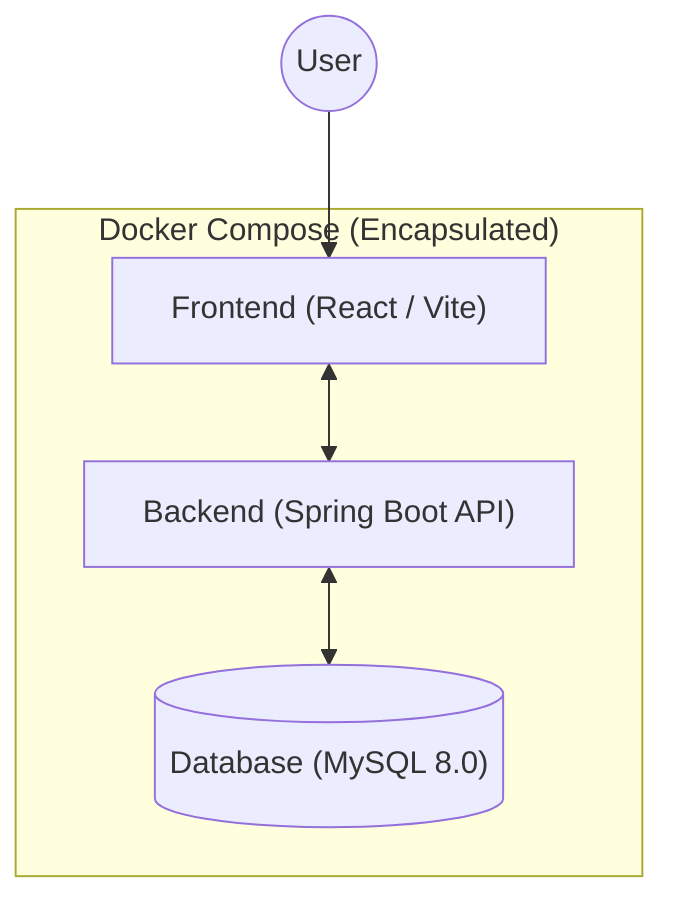

# 医療・介護 業務支援統合システム「Medivisor」 🏥

## 1. Download & Setup
システムの導入は以下の3ステップで完了します。

1. **リポジトリのクローン**
   ```bash
   git clone https://github.com/YukihitoTomojiri/medical-wiki-lms.git
   ```
2. **ディレクトリへ移動**
   ```bash
   cd medical-wiki-lms
   ```
3. **システムの起動**
   ```bash
   docker compose up --build
   ```

## 2. System Architecture
AI解析用に最適化されたシステム構成の概要です。



- **Frontend**: React / Vite (モダンなUI/UX、M3デザイン採用)
- **Backend**: Java 17 / Spring Boot 3 / Spring Data JPA
- **Database**: MySQL 8.0 (Dockerコンテナ内で管理)
- **Infrastructure**: Docker Compose による完全コンテナ化

## 3. Role & Permissions
システム内の役割に基づいた詳細な権限マトリクスです。

| 機能 | **ROLE_USER** (一般) | **ROLE_ADMIN** (管理者) | **ROLE_DEVELOPER** (開発) |
| :--- | :---: | :---: | :---: |
| **自分の申請閲覧・作成** | ◯ | ◯ | ◯ |
| **施設内の全職員の申請承認** | × | ◯ | ◯ |
| **施設情報の管理** | × | ◯ | ◯ |
| **全施設のデータ閲覧 (バイパス)** | × | × | **◯** |
| **システム設定・ログ監視** | × | × | ◯ |

> [!IMPORTANT]
> **ROLE_DEVELOPER** は施設フィルタをバイパスし、組織横断的なデータ分析やトラブルシューティングが可能です。

## 4. User Manual
### Login
システムの美しさと軽快な動作をログイン画面から体験できます。


- **テスト用アカウント**:
    - **開発者**: `dev` / `admin123`
    - **管理者**: `admin` / `admin123`
    - **一般職員**: `honkan001` / `user123`

### Leave Request
直感的なカレンダー操作で有給申請・勤怠管理が可能です。


- **機能概要**: 職員がカレンダーから日付を選択して申請を作成し、管理者が承認を行うワークフローを提供。

### Developer Console
画面下部に固定された開発者用コンソール。サイドバーやメインコンテンツとの干渉を完全に排除したレイアウトです。


- **機能概要**: システムの稼働ログ、リソース（CPU/メモリ/ディスク）使用率、セキュリティアラートをリアルタイムで監視。

- **開発者ダッシュボードのレイアウト刷新（情報の階層化とインタラクティブ化）**: セキュリティアラートの最上段移動、クリックで展開するユーザー数・施設数カード、重複情報の整理。
- **開発者ダッシュボードの統計カード整列と干渉の修正**: 視認性と操作性の向上。
- **操作デモ動画（WebP）の追加**: 視覚的なマニュアルの拡充。
- **サイドバーのスクロール領域拡張と開発者メニューの配置最適化**: メニュー操作性の向上。
- **開発者コンソールの Sticky 配置とレイアウト干渉防止**: 大画面での作業効率化。
- **プロジェクト名称を Medivisor へ変更**: ブランド刷新。
- **ROLE_DEVELOPER による施設フィルタバイパス実装**: 開発・監査効率の向上。
- 2026-02-14: お知らせから研修会詳細ページへの動線確保と遷移ボタンの実装。研修詳細からお知らせへ戻るボタンも追加。
- 2026-02-14: 研修会イベント連携機能のレスキュー完了。お知らせからWiki/イベント双方へのリンクが可能になりました。
- 2026-02-14: 有給休暇自動付与エンジンの実装完了（入社日ベースの自動付与ロジック）。
- **お知らせ × 研修マニュアル連携機能の実装**: お知らせに研修資料を紐付け、受講状況を管理。
- **お知らせ管理画面のフォームスクロール問題の修正**: 項目増大時の操作性を改善。
- **[障害復旧] サイトアクセス不能エラーの修正**: バックエンドBean定義競合（BeanCreationException）を解消し、システムを復旧。

- 2024-02-14: お知らせから研修会詳細ページへの遷移動線を強化。詳細モーダルの追加とダッシュボードの状態管理を改善。
- 2024-02-15: お知らせ詳細からの遷移ボタン実装とダッシュボード通知デザインの改善（未読バッジ、件数表示、プレビュー機能）。
- 2024-02-15: サイドバーの項目順序をユーザビリティ優先に変更。「Myダッシュボード」を最上段に配置。
- 2024-02-15: 研修詳細ページでサイドバーと干渉していた絶対配置の戻るボタンを削除し、レイアウトを最適化。
- 2024-02-15: Myダッシュボードのタブ切り替えUIの視認性向上（カラー連動によるテーマ切り替え）。
- 2024-02-15: Myダッシュボードのタブデザインをフォルダ形式（一体型）へ修正。選択タブとコンテンツが一枚の紙のように融合。
- 2024-02-15: MyダッシュボードのタブUI修正（枠線廃止・配色強化による一体化）。視認性と操作感を大幅に向上。
- 2024-02-15: Myダッシュボードのお知らせリストのネスト構造を簡素化。二重の箱を排除し、アクセシビリティを改善。
- 2024-02-15: お知らせ詳細モーダルの Z-Index 競合修正と背景不透明化。最前面表示を確実にし、視認性を向上。
- 2024-02-15: お知らせモーダルの React Portal 化による描画階層の分離と修復。親要素のスタイル干渉を完全に回避。
- 2024-02-15: 全ダッシュボードの UI デザイン統一（フォルダタブ化）。管理者・開発者ダッシュボードにも適用。「開発者メニュー」→「開発者ダッシュボード」に名称変更。
