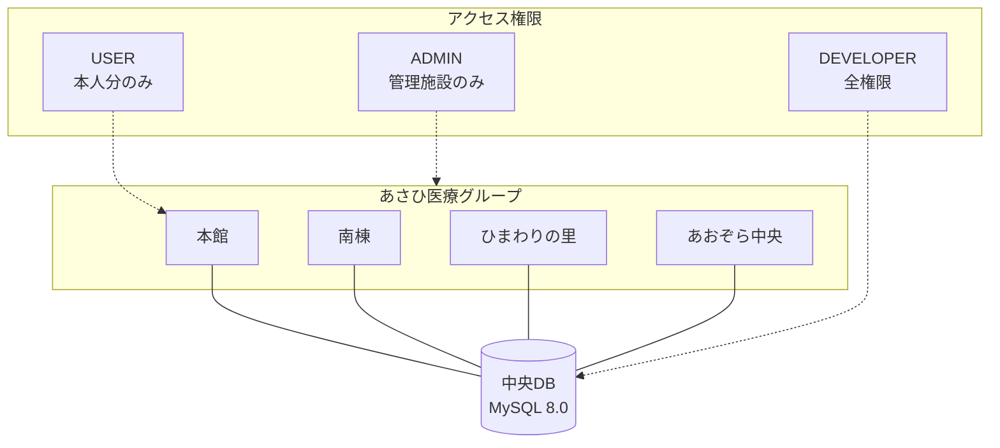

# README 可視化とセクション整理

## 1. 概要
`README.md` の文字数増加に伴う可読性低下を解消するため、Mermaid.js による図解の導入、目次（Table of Contents）の追加、および情報の構造化を行いました。

## 2. 変更内容

### 🏗️ システム全体像の図解
あさひ医療グループの4施設とデータベース、およびロールごとのアクセス範囲を視覚化しました。

### 🔄 申請フローの可視化
有給休暇・勤怠申請の流れ（申請→自動チェック→保存→承認）をシーケンス図で表現しました。

### 📑 目次とセクション整理
- **冒頭目次**: アンカーリンク付きの目次を追加し、各機能へ即座にアクセス可能にしました。
- **更新履歴の整理**: 「最近のアップデート」を折りたたみ (`
`) ブロックに格納し、初めて見る人には全体概要が、更新情報を知りたい人には詳細が見えるように整理しました。

## 3. データ整合性対応 (2026-02-08)

### 🧹 重複データのクリーンアップ
実装前のテストで発生したユーザー (honkan001) の申請重複（2026-02-07）を解消しました。
- **DB対応**: マイグレーションスクリプトにより、重複データを論理削除し、有効な1件（承認済みデータ）のみを残しました。
- **UI対応**: Myダッシュボードにユニークフィルタを導入し、万が一重複が存在しても画面上は正常に表示されるよう堅牢化しました。

## 4. UI/UX の高密度化・最適化 (2026-02-08)

### 📐 High Density Layout (Myダッシュボード)
13インチPC等の小型画面において一覧性が低下する問題を解消するため、UIを高密度化しました。
- **2カラムレイアウト化**: 「開始日/終了日」や「申請種別/取得単位」を横並びに配置し、縦方向のスペースを圧縮。
- **余白の削減**: `padding` や `margin` を最小限に抑え、1画面に表示できる情報量を増加。
- **スクロール領域の固定**: 申請履歴リストに `max-h-[600px]` を設定し、リストが増えても申請フォームが常に画面内に収まるよう改善。

### 🇯🇵 表現の改善と明確化
ユーザーが「いつ休むのか」を直感的に理解できるようにUIテキストを改善しました。
- **日付表示の分離**: 「取得予定日」を大きく、「申請日」を小さく表示し、いつの予定なのかを一目で判別可能に。
- **完全日本語化**: `PAID_LEAVE` などのシステム内部用語を排除し、「有給休暇」「欠勤」「遅刻」「早退」等の日本語バッジを表示。
- **承認日の明示**: 承認済みステータスの下に承認日を表示し、安心感を提供。
- **カードナビゲーション**: 上部のサマリーカードをクリックすることで、学習履歴・有給管理・お知らせの画面をスムーズに切り替えられるようにしました。
- **実質残日数の可視化**: 確定済みの有給残日数に加え、「申請中を含む実質残日数」を併記。全日（-1.0）や半日（-0.5）などの申請内容を加味して自動計算されます。
- **再計算エンジン**: 過去の履歴と現在の残日数の整合性を自動チェックし、常に正しい値を保証する再計算ロジックをバックエンドに実装しました。
- **管理画面の日本語化**: 管理者ダッシュボードにおいて、遅刻・早退・欠勤などの勤怠種別を日本語で表示し、確認負荷を軽減しました。
- **申請履歴のフィルタリング**: Myダッシュボード上で、「有給休暇」「欠勤」「遅刻」「早退」ごとに履歴を絞り込み表示できるようになりました。
- **有給取得単位の可視化**: 履歴一覧において、有給休暇が「全日」「半日(午前)」「半日(午後)」のいずれであるかをアイコン付きで明示し、一目で判別できるように改善しました。
- **過去データの読み込み**: 直近1年より前のデータも「過去の履歴をさらに読み込む」ボタンでシームレスに確認可能です。

### 🔄 有給休暇の自動計算ロジック (2026-02-08)
- **自動付与**: 入社日から法定通りの付与日数を自動計算し、有効期限（2年）も管理。
- **残日数シミュレーション**: 過去の履歴をトレースし、期限切れの有給を考慮した正確な残日数をMyダッシュボードに表示。
- **次回付与予測**: 次回の付与予定日と日数を表示し、計画的な取得をサポート。

### 🚨 年5日の有給取得義務アラート (2026-02-08)
- **取得義務状況カード**: Myダッシュボードの「有給休暇」タブ内に、新たに「年5日の有給取得義務状況」カードを追加しました。
- **進捗バー**: 今年度の義務対象期間における取得日数をプログレスバーで可視化。
- **警告表示**: 期限が迫っているにも関わらず未達成の場合、**黄色い警告アイコン** とメッセージで注意喚起を行います。
- **達成表示**: 義務（5日）を達成すると、カード全体が緑色になり、**達成済みのチェックマーク** が表示されます。

## 5. 確認方法
Myダッシュボードにアクセスし、上部のカード（学習完了、有給残日数、お知らせ）をクリックして、下部の表示内容が切り替わることを確認してください。
