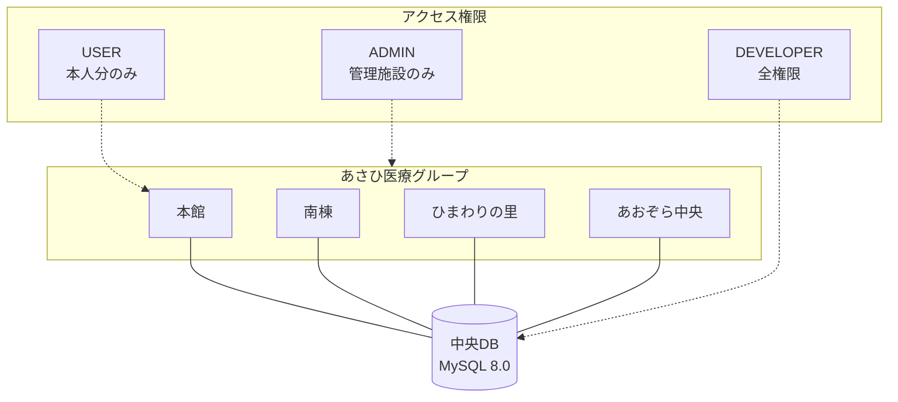

# README 可視化とセクション整理

## 1. 概要
`README.md` の文字数増加に伴う可読性低下を解消するため、Mermaid.js による図解の導入、目次（Table of Contents）の追加、および情報の構造化を行いました。

## 2. 変更内容

### 🏗️ システム全体像の図解
あさひ医療グループの4施設とデータベース、およびロールごとのアクセス範囲を視覚化しました。

### 🔄 申請フローの可視化
有給休暇・勤怠申請の流れ（申請→自動チェック→保存→承認）をシーケンス図で表現しました。

### 📑 目次とセクション整理
- **冒頭目次**: アンカーリンク付きの目次を追加し、各機能へ即座にアクセス可能にしました。
- **更新履歴の整理**: 「最近のアップデート」を折りたたみ (`
`) ブロックに格納し、初めて見る人には全体概要が、更新情報を知りたい人には詳細が見えるように整理しました。

## 3. データ整合性対応 (2026-02-08)

### 🧹 重複データのクリーンアップ
実装前のテストで発生したユーザー (honkan001) の申請重複（2026-02-07）を解消しました。
- **DB対応**: マイグレーションスクリプトにより、重複データを論理削除し、有効な1件（承認済みデータ）のみを残しました。
- **UI対応**: Myダッシュボードにユニークフィルタを導入し、万が一重複が存在しても画面上は正常に表示されるよう堅牢化しました。

## 4. UI/UX の高密度化・最適化 (2026-02-08)

### 📐 High Density Layout (Myダッシュボード)
13インチPC等の小型画面において一覧性が低下する問題を解消するため、UIを高密度化しました。
- **2カラムレイアウト化**: 「開始日/終了日」や「申請種別/取得単位」を横並びに配置し、縦方向のスペースを圧縮。
- **余白の削減**: `padding` や `margin` を最小限に抑え、1画面に表示できる情報量を増加。
- **スクロール領域の固定**: 申請履歴リストに `max-h-[600px]` を設定し、リストが増えても申請フォームが常に画面内に収まるよう改善。

### 🇯🇵 表現の改善と明確化
ユーザーが「いつ休むのか」を直感的に理解できるようにUIテキストを改善しました。
- **日付表示の分離**: 「取得予定日」を大きく、「申請日」を小さく表示し、いつの予定なのかを一目で判別可能に。
- **完全日本語化**: `PAID_LEAVE` などのシステム内部用語を排除し、「有給休暇」「欠勤」「遅刻」「早退」等の日本語バッジを表示。
- **承認日の明示**: 承認済みステータスの下に承認日を表示し、安心感を提供。
- **カードナビゲーション**: 上部のサマリーカードをクリックすることで、学習履歴・有給管理・お知らせの画面をスムーズに切り替えられるようにしました。
- **実質残日数の可視化**: 確定済みの有給残日数に加え、「申請中を含む実質残日数」を併記。全日（-1.0）や半日（-0.5）などの申請内容を加味して自動計算されます。
- **再計算エンジン**: 過去の履歴と現在の残日数の整合性を自動チェックし、常に正しい値を保証する再計算ロジックをバックエンドに実装しました。
- **管理画面の日本語化**: 管理者ダッシュボードにおいて、遅刻・早退・欠勤などの勤怠種別を日本語で表示し、確認負荷を軽減しました。
- **申請履歴のフィルタリング**: Myダッシュボード上で、「有給休暇」「欠勤」「遅刻」「早退」ごとに履歴を絞り込み表示できるようになりました。
- **有給取得単位の可視化**: 履歴一覧において、有給休暇が「全日」「半日(午前)」「半日(午後)」のいずれであるかをアイコン付きで明示し、一目で判別できるように改善しました。
- **過去データの読み込み**: 直近1年より前のデータも「過去の履歴をさらに読み込む」ボタンでシームレスに確認可能です。

## 5. 確認方法
Myダッシュボードにアクセスし、上部のカード（学習完了、有給残日数、お知らせ）をクリックして、下部の表示内容が切り替わることを確認してください。

## 6. 管理者ユーザー管理機能 (2026-02-08)

### 👥 施設管理者向けユーザー管理
施設管理者（ADMIN）が自施設のユーザーを直接管理できる機能を実装しました。

#### 変更内容
- **Backend**:
  - `SecurityConfig.java`: `/api/users/**` エンドポイントへの `ADMIN` アクセスを許可。
  - `UserService.java`: 施設ベースのアクセス制御を実装（ADMIN は自施設のみ操作可能）。
- **Frontend**:
  - `AdminUserManagement.tsx`: ユーザー一覧・編集・作成・削除のUI。
  - `Layout.tsx`: サイドバーに「ユーザー管理」リンクを追加。
  - `App.tsx`: `/admin/users` ルートを登録。

#### 権限仕様
| 操作 | DEVELOPER | ADMIN |
|:---|:---:|:---:|
| 全施設ユーザーの閲覧 | ✅ | ❌ |
| 自施設ユーザーの閲覧 | ✅ | ✅ |
| ユーザー作成 | ✅ (全施設) | ✅ (自施設のみ) |
| ユーザー編集 | ✅ (全施設) | ✅ (自施設のみ、DEVELOPER除く) |
| ユーザー削除 | ✅ (全施設) | ✅ (自施設のみ、DEVELOPER除く) |
| 施設変更 | ✅ | ❌ |

## 7. 開発者メニューのクリーンアップ (2026-02-08)

### 🧹 UI整理と日本語化
開発者ダッシュボードから重複するユーザー登録機能を削除し、UIを整理しました。

#### 変更内容
- **削除**:
  - `User Registration` セクション（フォームおよびCSVアップロード）を完全削除。
  - 未使用のインポート (`Upload`, `Plus`) と関連する状態変数・関数を削除。
- **日本語化**:
  - 「Active Nodes Control」→「稼働ノード管理」
  - 「Control access and user privileges」→「アクセス制御とユーザー権限の管理」
  - ボタン/ラベルの日本語化（「進捗リセット」「削除」「件選択中」）
- **移設先**:
  - ユーザー登録機能は `/admin/users`（ユーザー管理）へ統合済み。

## 8. メニュー統合リファクタリング (2026-02-08)

### 📌 サイドメニューへの機能統合
開発者メニューから「組織管理」「全ユーザー管理」タブを削除し、サイドメニューに統合しました。

#### 変更内容
- **開発者メニュー（DeveloperDashboard.tsx）**:
  - 削除タブ: 「組織管理」「全ユーザー管理」
  - 残存タブ: 「システム統計」「稼働状況」「レポート出力」「操作履歴」
- **サイドメニュー（Layout.tsx）**:
  - 「ユーザー管理」（`/admin/users`）→ ADMIN/DEVELOPER がアクセス可能
  - 「組織管理」（`/admin/organization`）→ DEVELOPER のみアクセス可能
- **新規ページ**:
  - `OrganizationManagement.tsx` → 施設・部署管理の独立ページ
  - `AdminUserManagement.tsx` → ユーザー管理の独立ページ

#### メニュー構成（変更後）
| メニュー | パス | アクセス権限 |
|---------|------|-------------|
| マニュアル | `/manuals` | 全ユーザー |
| Myダッシュボード | `/my-dashboard` | 全ユーザー |
| 管理者ダッシュボード | `/admin` | ADMIN / DEVELOPER |
| ユーザー管理 | `/admin/users` | ADMIN / DEVELOPER |
| 組織管理 | `/admin/organization` | DEVELOPER のみ |
| 開発者メニュー | `/developer` | DEVELOPER のみ |

## 9. 権限に応じたサイドバーの動的制御 (2026-02-10)

### 📌 サイドバーのリファクタリングとデザイン刷新
ユーザーの役割（ロール）に応じて最適なメニューを提供するため、サイドバーを独立したコンポーネントとして抽出し、表示制御を強化しました。

#### 変更内容
- **コンポーネント化 (`Sidebar.tsx`)**:
  - `Layout.tsx` からナビゲーションロジックを分離。
  - モバイルとデスクトップで共通の `Sidebar` コンポーネントを使用。
- **ロールベース表示制御**:
  - **一般ユーザー**: 必要最小限の項目（マニュアル、Myダッシュボード）のみ表示。
  - **管理者/開発者**: 「管理設定」「システム開発」といったセクション名を追加し、項目をグループ化。
- **視覚的なセグメンテーション**:
  - 管理・開発用メニューには背景色（Slate/Amber）を適用。
  - **アクティブ状態の強化**: 現在選択されているメニュー項目をオレンジ（`bg-orange-500`）背景＋白文字で強調。
  - 非選択時のホバー表現も薄いオレンジ（`bg-orange-50`）に統一。
  - 角丸の調整（`rounded-lg`）と左右余白の設定により、視認性と操作性を向上。
- **アクセス制御**:
  - ロールごとに表示されるべきリンクのみをレンダリングすることで、誤操作を防止。

#### ロール別表示構成
- **一般スタッフ**: メインメニュー（マニュアル、Myダッシュボード）
- **施設管理者**: メインメニュー + 管理設定（管理者DB、ユーザー管理）
- **開発者**: メインメニュー + 管理設定 + システム開発（組織管理、開発者メニュー）

## 10. デザインシステム導入 (2026-02-10)

### 📌 UI/UX一貫性の確保

アプリケーション全体で色使いやコンポーネントスタイルがバラバラだった問題を解消するため、統一されたデザインシステムを導入しました。

#### 課題
- ページごとに異なるアクセント色（indigo、emerald、orange、amber）が混在
- ボタンやカード、フォーカスリングのスタイルが統一されていない
- `medical` と `primary` のカラートークンが重複

#### 変更ファイルと内容

| ファイル | 変更内容 |
|---------|---------|
| `tailwind.config.js` | `primary`（orange-600系）を統一アクセントに、`medical` をエイリアスに、セマンティックカラー追加 |
| `index.css` | 共通ユーティリティ（`.card`, `.btn-primary`, `.form-input`, `.badge-*` 等）を定義 |
| `Layout.tsx` | ベース背景を `bg-slate-50` に、ロゴを `primary-600` グラデーションに変更 |
| `ManualList.tsx` | ProgressCard を `primary-600/700` に、カードに `.card` utility 適用 |
| `AdminDashboard.tsx` | タブを `primary-600` トークンに統一 |
| `AdminUserManagement.tsx` | indigo→primary-600, emerald→primary-600 に全面統一 |
| `DeveloperDashboard.tsx` | ヘッダーグラデーション・タブを `primary-600` に統一 |
| `README.md` | デザインガイドラインセクションを新設 |

#### 設計方針
- **`primary-600`（#ea580c）** をメインアクセントとし、全てのインタラクティブ要素で使用
- ステータス表示は意味に応じたセマンティックカラー（success/warning/danger）を維持
- `index.css` の共通クラスを活用し、新規ページでも一貫したスタイルを簡単に適用可能に

## 11. デザインシステム統合作業 (2026-02-10)

### 🎨 カラーパレットとコンポーネントの統一
アプリケーション全体のアクセントカラーを「オレンジ (`primary-600`)」に統一し、場所によってバラついていた色（青、緑など）を排除しました。また、共通ヘッダーコンポーネント `PageHeader` を導入し、全画面で一貫したヘッダーデザインを実現しました。

- **マニュアル一覧**: 巨大バナーを廃止し、統計情報をコンパクトなカードに変更。
- **組織管理**: 青色ベースのデザインをオレンジベースに変更し、リストスタイルを統一。
- **各種ダッシュボード**: 警告色と正常色の使い分けを明確化。

## 12. 組織管理画面のデザイン完全統一 (Fix: Organization Design Unification)

### 🧩 残存する非統一要素の解消
`OrganizationManagement.tsx` に残っていた青色要素（ボタン、フォーム背景など）を完全に排除し、オレンジ (`primary-600`) に統一しました。

- **配色**: 施設追加フォーム、部署追加ボタン、編集/削除アイコンのホバー色をオレンジ系へ変更。
- **レイアウト**: 施設リストのコンテナスタイルを、他の管理画面と共通の `rounded-xl shadow-sm` に修正。

これにより、アプリケーション内から「意図しない青色要素」が完全に排除され、ブランドイメージの一貫性が確保されました。

## 13. 組織管理メニューの集約とセキュリティ強化 (2026-02-10)

### 🔄 メニュー構成の最適化（Fix: Unify Organization Menu）
「組織管理」機能への導線を整理し、管理者と開発者が同じ「管理設定」セクションからアクセスできるように統一しました。

- **Sidebar**: `システム開発` から `管理設定` へ移動。管理者(ADMIN)もアクセスしやすくなりました。
- **Dashboard**: 管理者ダッシュボード内の重複していた「組織管理」タブを削除し、サイドバー起点の操作に一本化しました。

### 🔒 バックエンドセキュリティ強化
- **API Access**: `/api/facilities/**` および `/api/departments/**` へのアクセスを、`ADMIN` または `DEVELOPER` 権限を持つユーザーのみに厳格に制限しました（`SecurityConfig.java`）。

## 14. 組織データ表示復旧とデザイン統合の完遂 (Fix: Restore Org Data)

### 🚑 緊急修正対応
セキュリティ強化後に発生した「組織管理画面でデータが表示されない」問題を解決しました。

- **Frontend (`api.ts`, `OrganizationManagement.tsx`)**: 
  - API呼び出し時に `X-User-Id` ヘッダーを正しく送信するように修正。
  - データ取得および更新処理において、認証済みユーザーIDを必須としました。
  - `pages/` と `components/` に重複していた `OrganizationManagement.tsx` を `pages/` に統合し、古いコードを排除しました。
- **Backend (`FacilityController.java`)**: 
  - ユーザーのロールに基づいたデータフィルタリングを実装。
  - `ADMIN`: 自身の所属する施設のみを表示・操作可能に制限。
  - `DEVELOPER`: 全ての施設を表示・操作可能。
- **UI Consistency**: 
  - 組織管理画面に残っていた青色要素を完全にオレンジ (`primary-600`) に置換し、デザインシステムへの統合を完了しました。

## 15. Warm Orange UI の適用範囲拡大 (2026-02-11)

### 🎨 デザイン適用範囲の拡張 (Unified Warm Orange UI)
「親しみやすさ」と「視認性」を向上させる Warm Orange UI (M3) を、以下の管理系ページにも適用しました。

#### 対象ページ
- **ユーザー管理 (`/admin/users`)**:
  - ヘッダーを `PageHeader` に統一し、オレンジのアクセントカラーを適用。
  - 検索フィルターとリストのデザインを、他の管理画面と統一されたカードスタイル (`rounded-[28px]`, `shadow-sm`) に刷新。
- **組織管理 (`/admin/organization`)**:
  - `PageHeader` を導入し、青色ベースだったデザインをオレンジベースに完全移行。
- **開発者ダッシュボード (`/developer`)**:
  - ヘッダー部分を `PageHeader` に置き換え、システムバージョンや同期時刻の表示をリッチなスタイルに変更。
  - サブタイトルに `ReactNode` を渡せるように `PageHeader` コンポーネントを拡張。

これにより、一般ユーザー向け画面だけでなく、管理者・開発者向け画面においても一貫した「Warm Orange」の世界観が提供されるようになりました。

## 16. Modern Header & Logo Design (2026-02-11)

### 🎨 ヘッダーデザインの刷新
ユーザーからの要望を受け、アプリケーションのヘッダーデザインを全面的に刷新しました。

#### 変更点
- **ダークテーマヘッダー**: 従来のホワイト/グレーベースから、深いオレンジブラウン (`#2D1600`) を基調としたモダンなダークテーマに変更しました。
- **ボーダーレスデザイン**: ヘッダー下部の境界線を排除し、コンテンツとの一体感を高めつつ、ドロップシャドウで階層を表現しました。
- **新規ロゴ**: "Medical Wiki LMS Network" の文字を含む、視認性の高いSVGロゴを新たに作成・配置しました。
- **トップナビゲーション化**: `Navbar` コンポーネントをレイアウトの最上部に配置し、デスクトップ・モバイル問わず常にブランドとユーザー情報が表示されるようにしました。
- **マイクロコピー**: ヘッダー内に「専門知識で、現場を守る。」というメッセージを配置し、システムの目的を明確化しました。

これにより、システム全体の印象がよりプロフェッショナルかつ現代的なものへと生まれ変わりました。

## 17. Header Visibility Fix (2026-02-11)

### 🎨 ヘッダーの視認性改善
特定の表示条件下でヘッダーが白く見えてしまう問題を解消し、常に高いコントラストを保つデザインへ修正しました。

#### 主な変更
- **背景色の固定**: ヘッダーに `#2D1600` (深みのあるダークオレンジ) を直接指定し、白背景との同化を防止しました。
- **ロゴの明瞭化**: 白い角丸コンテナの中にアイコンを配置するスタイルにより、どんなカラーテーマでもロゴがはっきりと見えるようにしました。
- **キャッチコピーの追加**: ヘッダー内にシステム精神を表すマイクロコピーを配置し、UIにアクセントを加えました。
- **テーマ定義の導入**: `src/theme/colors.js` を作成し、一貫した配色管理の基礎を整備しました。

## 18. Console & Logout Position Refactor (2026-02-11)

### 🖥️ 開発者コンソールの改善とレイアウトの最適化
開発者向け機能の使い勝手を向上させるため、ログコンソールの視認性改善と、全ロール共通のログアウト導線の整理を行いました。

#### 主な変更
- **ログコンソールの不透明化**: 開発者ダッシュボード下部の「SYSTEM LOG CONSOLE」の背景を、透過なしの `bg-slate-900` に変更。これにより、背後のフォームやボタンと重なっても内容がはっきりと読み取れるようになりました。また、`z-index` を引き上げ、常に最前面に表示されるようにしました。
- **ログアウトボタンのヘッダー移設**: 
    - サイドメニュー下部にあったログアウトボタンを廃止しました。
    - 新しいトップナビゲーション（ヘッダー）のユーザーアイコン横に、`LogOut` アイコンを配置しました。
    - これにより、サイドメニューを開閉することなく、どの画面からでもワンクリックでログアウトが可能になり、ログコンソールとの物理的な干渉も解消されました。

## 19. Material Design 3 UIアップデート (2026-02-11)

### 🎨 M3 Shape & Component リフレッシュ
UIコンポーネントをMaterial Design 3の形状ガイドラインに準拠させ、視覚的なモダン化を図りました。

#### Tailwind Config
- `borderRadius` に M3 Shape Scale (`m3-none`〜`m3-xl`) を追加し、デザイントークンとして一元管理
- `boxShadow` に M3 Elevation レベル (`m3-0`〜`m3-3`) を追加
- 不足していたカラートークン (`secondary-container`, `tertiary-container`, `error-container` 等) を補完

#### UIプリミティブ
- **Button**: `gap-2` でアイコンとテキストの間隔を確保、shadowをM3トークンに統一、`isLoading` 時のスピナーを内蔵化
- **Card**: 角丸を `rounded-m3-xl` (28px) に拡大し、影を抑えてSurface階層で深度を表現
- **Input**: Outlined（`rounded-m3-lg` + ボーダー）と Filled（上角丸 + 下線）を明確化
- **Badge**: `rounded-md` → `rounded-full`（ピル形状）
- **NavigationDrawer**: 高さを `h-14` に統一、非アクティブ時のアイコン線幅を細く

#### コンポーネント
- **ConfirmModal**: M3 Dialog（`rounded-m3-xl`, scrimカラー, ピル形状ボタン, 右揃えアクション）
- **PageHeader**: アイコンコンテナを `rounded-2xl` に拡大、デフォルトカラーをM3トークンに変更

#### ページ
- **Login**: カード・入力・ボタン・エラー表示をすべてM3トークンで統一

## 20. 管理者ダッシュボードの表示バグ修正 (2026-02-11)

### 🖥️ 表示の重複解消とリストの最適化
管理者ダッシュボードで特定のコンポーネントが2重に表示される不具合を修正し、データ量が多い場合でも操作しやすいようにレイアウトを改善しました。

#### 主な変更
- **重複表示の削除**: `AdminDashboard.tsx` における「有給取得モニタリング」コンポーネントの重複した呼び出し箇所を修正しました。
- **内部スクロールの導入**: リスト部分に `max-height` (600px) を設定し、データ量が増えても画面全体のレイアウトが崩れず、リスト内のみでスクロールできるようにしました。
- **固定ヘッダー (Sticky Header)**: テーブルのヘッダーをスクロール時に固定されるように変更し、どの行を見ていても項目名がわかるようにしました。

## 21. 有給取得義務カードのM3最適化と期限表示追加 (2026-02-11)

### 📊 有給取得状況の可視化改善
マイページの「年5日の有給取得義務」カードのデザインを Material Design 3 に準拠させ、取得期限を明示するように変更しました。

#### 主な変更
- **M3デザイン刷新**: カードの角丸を拡大（28px）し、影や背景色を M3 の Elevated Card 仕様に最適化しました。
- **取得期限の表示**: 年度ごとの取得義務の期限（基準日の1年後）をカード上部に表示し、いつまでに取得が必要か一目でわかるようにしました。
- **プログレスバーの改善**: バーの太さを調整し、視認性の高い配色に変更しました。
- **警告表示の強化**: 期限まで3ヶ月を切っている場合、赤色の警告色とアニメーション（パルス効果）を用いて注意を促すようにしました。

## 22. 有給休暇の期間指定・一括申請機能 (2026-02-11)

### 🗓️ 柔軟な休暇申請の実現
有給休暇申請フォームを拡張し、一度の操作で複数の期間（飛び石連休など）をまとめて申請できるようにしました。

#### 主な変更
- **期間追加UIの実装**: 「期間を追加」ボタンを押すことで、申請枠を自由に増やせる M3 スタイルのフォームコンポーネントを作成しました。
- **一括申請処理**: バックエンドに一括申請用の API を追加し、全ての期間が正常に受理されるか、または重複等のエラーがあるかを一括で判定・処理するようにしました。
- **自動計算**: 追加された全ての期間の合計日数を自動で計算し、申請前に消費する有給残日数を明確に表示するようにしました。これにより、計算ミスによる申請不備を防ぎます。
