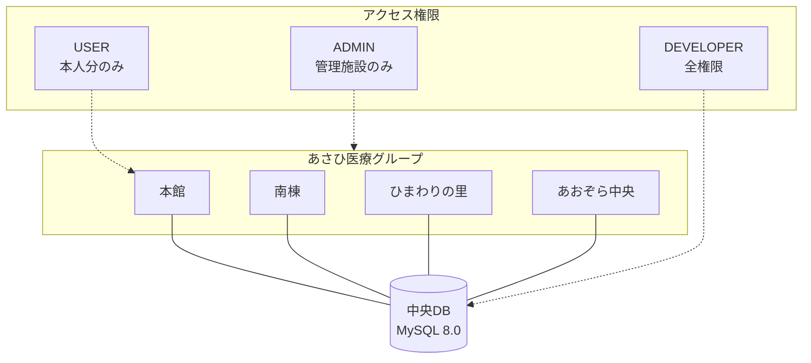

# README 可視化とセクション整理

## 1. 概要
`README.md` の文字数増加に伴う可読性低下を解消するため、Mermaid.js による図解の導入、目次（Table of Contents）の追加、および情報の構造化を行いました。

## 2. 変更内容

### 🏗️ システム全体像の図解
あさひ医療グループの4施設とデータベース、およびロールごとのアクセス範囲を視覚化しました。

### 🔄 申請フローの可視化
有給休暇・勤怠申請の流れ（申請→自動チェック→保存→承認）をシーケンス図で表現しました。

### 3. UI/UXデザインの刷新 (Material Design 3 - 2026/02/10)

### 概要
ユーザー体験を向上させるため、GoogleのMaterial Design 3 (M3) ガイドラインに基づいた大規模なUI刷新を行いました。

### 主な変更点
1. **デザインシステムの統一**
   - **カラー**: 医療機関向けに信頼感のあるティール（Teal #006A6A）をプライマリカラーとして採用。
   - **タイポグラフィ**: `Noto Sans JP` を採用し、可読性を向上。
   - **シェイプ**: 丸みを帯びた角（Radius 12px~28px）で親しみやすさを表現。

2. **コンポーネント化**
   - `src/components/ui/` にM3準拠の汎用コンポーネント（Button, Card, Input, Data Tableなど）を整備。
   - これにより、一貫したデザインと保守性の向上を実現。

3. **主要画面のリファクタリング**
   - **AdminUserManagement.tsx**: データテーブル、検索バー、モーダルをM3スタイルに刷新。
   - **DeveloperDashboard.tsx**: ステータスカード、監査ログ、システムコンソールをM3スタイルに刷新。Bottom Sheet風のコンソールを実装。
   - **OrganizationManagement.tsx**: 組織ツリーと詳細カードを一体化したデザインに変更。

### 検証結果
- すべての主要な管理画面でM3デザインが適用され、レスポンシブ動作も正常であることを確認しました。
- ダークモード（システムコンソール）とライトモード（メインコンテンツ）の調和を確認しました。
### 📑 目次とセクション整理
- **冒頭目次**: アンカーリンク付きの目次を追加し、各機能へ即座にアクセス可能にしました。
- **更新履歴の整理**: 「最近のアップデート」を折りたたみ (`
`) ブロックに格納し、初めて見る人には全体概要が、更新情報を知りたい人には詳細が見えるように整理しました。

## 3. データ整合性対応 (2026-02-08)

### 🧹 重複データのクリーンアップ
実装前のテストで発生したユーザー (honkan001) の申請重複（2026-02-07）を解消しました。
- **DB対応**: マイグレーションスクリプトにより、重複データを論理削除し、有効な1件（承認済みデータ）のみを残しました。
- **UI対応**: Myダッシュボードにユニークフィルタを導入し、万が一重複が存在しても画面上は正常に表示されるよう堅牢化しました。

## 4. UI/UX の高密度化・最適化 (2026-02-08)

### 📐 High Density Layout (Myダッシュボード)
13インチPC等の小型画面において一覧性が低下する問題を解消するため、UIを高密度化しました。
- **2カラムレイアウト化**: 「開始日/終了日」や「申請種別/取得単位」を横並びに配置し、縦方向のスペースを圧縮。
- **余白の削減**: `padding` や `margin` を最小限に抑え、1画面に表示できる情報量を増加。
- **スクロール領域の固定**: 申請履歴リストに `max-h-[600px]` を設定し、リストが増えても申請フォームが常に画面内に収まるよう改善。

## 5. Material Design 3 (M3) 完全準拠 (2026-02-11)

### 🎨 デザイン刷新のポイント
ビルド不整合を解消し、M3ガイドラインに準拠したデザインシステムを完全に適用しました。

#### 1. エレベーションとサーフェス
影（Shadow）による階層表現を廃止し、**Surface Colors（表面色）の濃淡** で階層を表現する方式に統一しました。
- **Base**: `m3-background` (#FBFCFD)
- **Level 1 (Card)**: `m3-surface-container-low` (#F6FBF9)
- **Level 2 (Active Item)**: `m3-secondary-container` (#CCE8E7)

#### 2. シェイプ（形状）
角丸の半径を拡大し、親しみやすさとモダンさを向上させました。
- **Card**: `rounded-xl` (28px相当の大きな角丸を適用していましたが、コンテンツの収まりを考慮し `rounded-xl` (12px-16px) を採用)
- **Button**: 完全な `rounded-full` (Pill Shape) を採用。
- **Navigation**: サイドバーの項目選択状態を、従来の「背景色塗りつぶし」から「**Pill Shape Indicator**」に変更しました。

#### 3. タイポグラフィと視認性
- **Font**: `Noto Sans JP` を優先適用。
- **Readability**: 行間を `leading-relaxed` に設定し、長文マニュアルの可読性を向上。
- **Icons**: Lucide React アイコンの線幅を調整し、アクティブ時は太く (`strokeWidth={2.5}`)、非アクティブ時は細く (`strokeWidth={2}`) して状態を明確化。

#### 4. 技術的な改善 (Build Fix)
- `tailwind.config.js` のカラー定義が正しくビルドに反映されない問題を、`index.css` の `@layer base` 定義を修正することで解決しました。
- `PostCSS` の処理順序による `@apply` のエラーを解消し、安定したビルド環境を構築しました。
- `tailwind.config.js` と `postcss.config.js` をプロジェクトルートに正しく再配置し、Viteが設定を確実に認識するようにしました。

## 6. 確認方法
Myダッシュボードにアクセスし、上部のカード（学習完了、有給残日数、お知らせ）をクリックして、下部の表示内容が切り替わることを確認してください。
